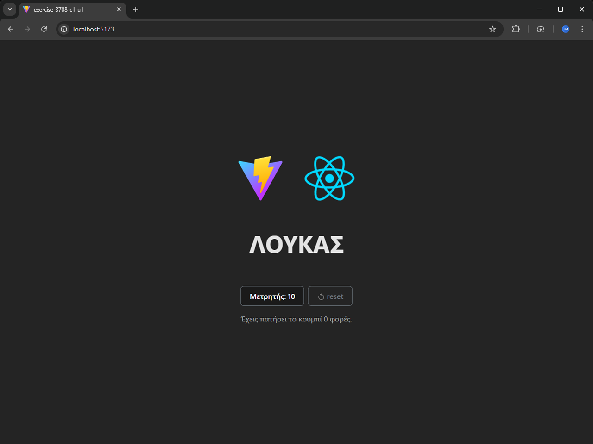

# 01 - Counter

Exercise from the **React Basic** module of the UOA E-Learning React JS Developer for entry level Job Program.

## Description

A React application that displays a name inside an `<h1>` element and a button counter that doubles on each click: 10, 20, 40, 80...



## Key Concepts

- Functional components
- `useState` hook
- Event handling

## Tech Stack

React 18 &bull; TypeScript &bull; Vite

## Running the Exercise

```bash
npm install
npm run dev
```
