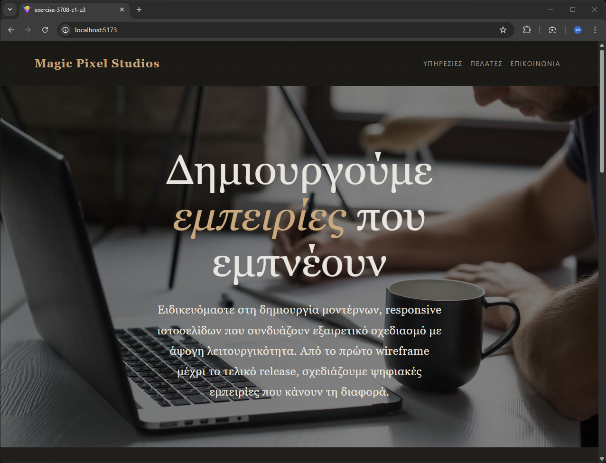

# 03 - Styled Components

Exercise from the **React Basic** module of the UOA E-Learning React JS Developer for entry level Job Program.

## Description

A React application with three custom styled `<p>` components, each with distinct styling defined via CSS-in-JS.



## Key Concepts

- CSS-in-JS
- styled-components
- Component styling

## Tech Stack

React 18 &bull; TypeScript &bull; Vite &bull; styled-components

## Running the Exercise

```bash
npm install
npm run dev
```
