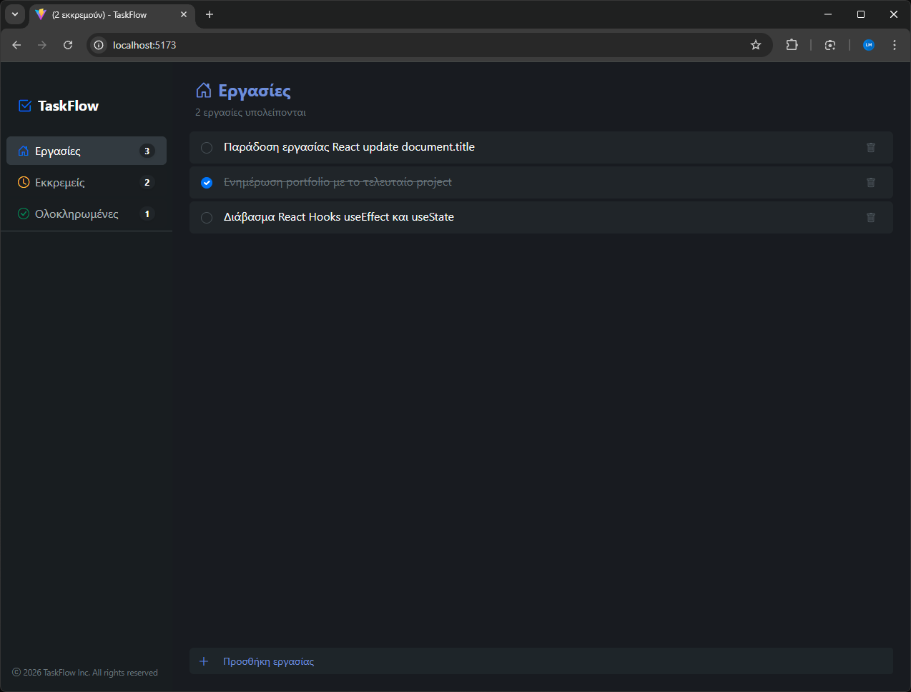

# 01 - Hooks

Exercise from the **React Advanced** module of the UOA E-Learning React JS Developer for entry level Job Program.

## Description

A React application that uses the `useEffect` hook to dynamically update `document.title` based on component state.



## Key Concepts

- `useEffect` hook
- Side effects
- Component lifecycle

## Tech Stack

React 18 &bull; TypeScript &bull; Vite

## Running the Exercise

```bash
npm install
npm run dev
```
