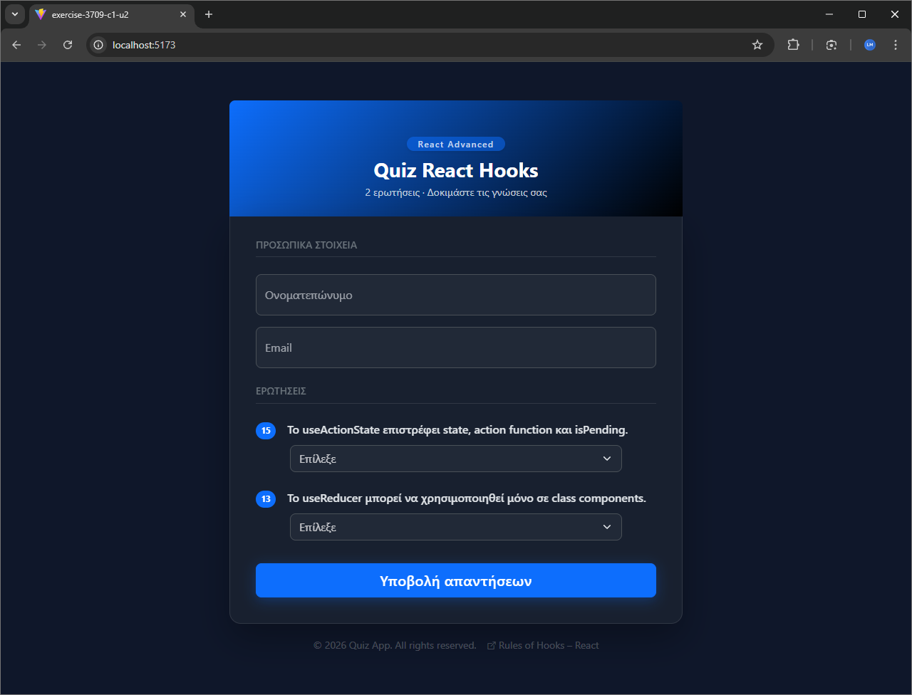

# 02 - Forms

Exercise from the **React Advanced** module of the UOA E-Learning React JS Developer for entry level Job Program.

## Description

A React quiz application with a React Bootstrap form collecting a name, email, and answers to two true/false questions.



## Key Concepts

- Controlled forms
- Form validation
- React Bootstrap

## Tech Stack

React 18 &bull; TypeScript &bull; Vite &bull; React Bootstrap &bull; Bootstrap 5

## Running the Exercise

```bash
npm install
npm run dev
```
