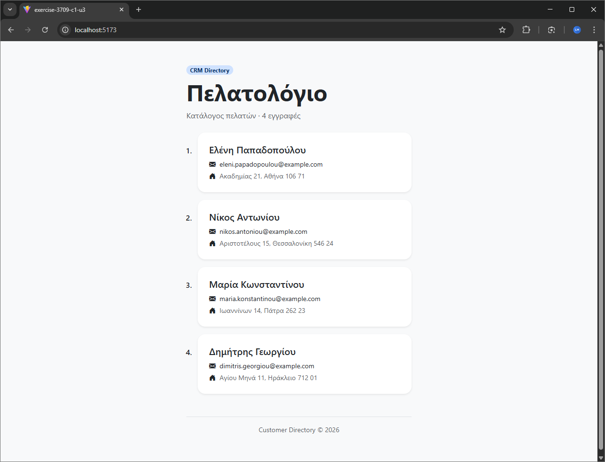

# 03 - Fetch JSON

Exercise from the **React Advanced** module of the UOA E-Learning React JS Developer for entry level Job Program.

## Description

A React customer directory that fetches data from a local JSON file and displays each record (name, email, address) as an item in a numbered list.



## Key Concepts

- `useEffect` hook
- Fetch API
- Rendering lists with `key`
- Error handling

## Tech Stack

React 18 &bull; TypeScript &bull; Vite

## Running the Exercise

```bash
npm install
npm run dev
```
